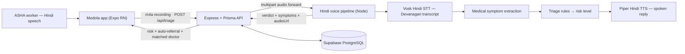

<div align="center">
  

# Medola

**Voice-first healthcare triage for India's ASHA workers.**

Speak in Hindi. Get a risk verdict, a spoken Hindi reply, and a doctor
appointment — even when the village has no network.

*Smart India Hackathon 2026*


</div>

---

## The problem

ASHA workers are the backbone of rural primary care, yet every patient
interaction today is manual, English/form-centric, and paper-tracked:

- Health records and referrals are filled by hand and easily lost.
- Symptom-to-escalation decisions depend on memory and experience.
- Connectivity in villages is intermittent — a "cloud-only" tool fails
  exactly where it is needed most.

Medola turns the worker's phone into a voice-driven triage assistant that
works in **Hindi**, runs **offline-first**, and leaves a clean digital trail
(patients, triage history, referrals, appointments, follow-ups).

## What the app does

The worker opens Medola, picks (or adds) a patient, holds the mic button, and
speaks in Hindi. In a few seconds the app plays back a **spoken Hindi
verdict** and shows:

- **Risk level** — EMERGENCY / URGENT / ROUTINE / SELF_CARE with a colour-coded badge.
- **Extracted symptoms** — detected medical entities from the utterance.
- **Auto-referral card** — created server-side for EMERGENCY/URGENT cases.
- **Doctor match + appointment booking** — a mock doctor directory is scored
  by specialty keywords and facility tier; the worker picks a slot and confirms.
- **Patient profile** — every past triage, appointment, referral and follow-up
  for that patient, each triage bookable against a doctor.
- **Follow-up dashboard** — due-today list with one-tap completion.
- **Offline queue** — recordings made with no network are stored locally
  (SQLite) and auto-upload when connectivity returns; the patient list is
  snapshotted so triage works fully offline.
- **Bilingual UI** — English / हिंदी toggle, persisted across launches.

## How it works



1. The app records **m4a** and uploads it via `POST /api/triage`.
2. The backend forwards the audio to the voice microservice (port 4000).
3. The voice pipeline converts it to 16 kHz WAV (ffmpeg), transcribes with
   **Vosk** (`vosk-model-small-hi-0.22`), extracts symptoms, applies triage
   rules, and synthesizes a **Piper Hindi TTS** reply.
4. The backend stores the triage record, **auto-creates a referral** for
   EMERGENCY/URGENT verdicts, and returns the verdict + spoken reply URL.
5. The app plays the reply and offers doctor-matched booking.

### Triage levels

| Verdict | Hindi label | Doctor facility tier | Auto-referral |
| --- | --- | --- | --- |
| EMERGENCY | गंभीर आपातकालीन | District | Yes |
| URGENT | जल्दी जांच ज़रूरी | District / CHC | Yes |
| ROUTINE | नियमित परामर्श | CHC / PHC | No |
| SELF_CARE | घर पर देखभाल | — | No |

### Offline-first design

- **Offline triage** — with no network the recording is queued locally and
  re-uploads via `POST /api/triage` on reconnect (never a faked verdict).
- **Offline appointments** — queued as vouchers and synced via `POST /api/sync`
  with last-write-wins conflict resolution (`updatedAt` comparison).
- **Cached patients** — the patient list is snapshotted to SQLite on every
  successful fetch, so patient selection never blocks the offline flow.
- A dashboard footer + a dedicated **Sync Status** screen show the live
  connection state, pending count, and last-sync time.

## Repository layout

```
.
├── logo.jpeg                      # Medola logo (used in-app)
├── healora-app/                   # Expo (React Native) ASHA worker app
│   └── src/
│       ├── api/                   # typed API client (axios + JWT interceptor)
│       ├── components/            # AppButton, PatientList, BrandHeader, Icon, ...
│       ├── db/                    # SQLite offline queue + cached patients
│       ├── hooks/                 # useVoiceRecorder (expo-audio), useOnlineStatus
│       ├── i18n/                  # EN / हिंदी labels
│       ├── navigation/            # auth-gated native stack
│       ├── screens/               # Login, Home, Patients, Profile, Triage, ...
│       └── store/                 # auth context, language, offline queue
├── healora-backend/               # Express + Prisma API (port 3000)
│   ├── prisma/schema.prisma       # Patient, AshaWorker, Doctor, TriageRecord,
│   │                              #   Appointment, Referral, FollowUp
│   └── seed/                      # demo worker, mock doctors, patients
└── hindi-voice-service/
    └── hindi-medical-voice-backend/  # Voice microservice (port 4000)
        ├── src/                   # Vosk STT, symptom extraction, triage, Piper TTS
        ├── models/                # Vosk Hindi model (downloaded)
        └── public/samples/        # sample Hindi clips for demoing without a mic
```

## Tech stack

| Layer | Tech |
| --- | --- |
| Mobile app | Expo SDK 57, React Native 0.86, expo-audio, expo-sqlite, expo-secure-store, expo-image, expo-symbols |
| API | Node.js 20, Express, Prisma ORM, JWT auth (7-day tokens) |
| Voice pipeline | Node.js 20, Vosk (Hindi STT), Piper (Hindi TTS), ffmpeg |
| Database | PostgreSQL on Supabase (free tier) |
| Offline layer | SQLite queue + patient snapshot, auto-sync on reconnect |

## Quickstart (dev)

**Prerequisites:** `nvm`; a PostgreSQL instance (Supabase free tier works —
copy the **pooler** connection string, it resolves IPv4); a phone with
Expo Go for the app.

Node version split: the **app** uses Node 22 (`.nvmrc` = 22.23.2); the
**backend and voice service** stay on **20.11.1** (the `vosk`/`ffi-napi`
native build breaks on newer Node headers).

```bash
# 1) API — http://localhost:3000
cd healora-backend
nvm use 20.11.1
npm install
cp .env.example .env       # fill DATABASE_URL, JWT_SECRET, VOICE_SERVICE_URL
npx prisma generate
npx prisma migrate deploy
npm run seed               # demo worker + mock doctors + patients
npm run dev

# 2) Voice pipeline — http://localhost:4000
cd ../hindi-voice-service/hindi-medical-voice-backend
nvm use 20.11.1
npm install
npm run download-models    # Vosk Hindi (~79 MB) + Piper Hindi voice
npm run dev

# 3) App — scan the QR with Expo Go
cd ../../../healora-app
nvm use 22.23.2
npm install
API_BASE_URL=http://<your-LAN-IP>:3000 npx expo start
# Android emulator instead? use http://10.0.2.2:3000
```

Health checks: `curl http://localhost:3000/health` and
`curl http://localhost:4000/health`.

**Demo login:** phone `9999999999`, password `asha123`
(Sunita Devi (Demo ASHA), village Kishangarh).

## 10-minute demo script

1. **Login** with the demo credentials — the dashboard shows today's
   follow-ups and a live sync status footer.
2. **Voice triage (ROUTINE):** Start Triage → pick a patient → hold the mic
   and say **"मुझे बुखार है और खांसी भी हो रही है"** → fever/cough symptoms,
   ROUTINE badge, and a spoken Hindi reply (tap play/pause to replay).
3. **Voice triage (EMERGENCY):** record again with
   **"मेरे सीने में बहुत दर्द है और सांस लेने में तकलीफ हो रही है"** →
   EMERGENCY verdict **with an auto-generated referral card**.
4. **Book & confirm:** from the result (or the patient profile) → pick a
   slot → book → matched doctor card → confirm.
5. **Offline mode:** turn on airplane mode → record a triage → "saved
   offline" → Sync Status shows the queued item → turn network back on →
   the item auto-syncs (verdict arrives, queue drains).
6. **Bilingual UI:** Settings → switch to हिंदी — the entire app relabels
   instantly and persists.

No mic at hand? Replay the pipeline with the sample clips in
`hindi-voice-service/hindi-medical-voice-backend/public/samples/`.

## Install on Android (no laptop needed)

- **Judges / standalone demo:** download the APK from
  [GitHub Releases](https://github.com/gsraj0301/SIH2026/releases), allow
  "Install unknown apps" for your browser, and open Medola. Release builds
  point at the hosted backend (see Deployment), so it works anywhere with
  internet. If no APK is attached yet, use the dev quickstart above.
- **Developers:** `npx expo start` + Expo Go (same network as the API).

## API overview

All routes except `/api/auth/*` and `/health` require
`Authorization: Bearer <JWT>`.

| Method | Route | Purpose |
| --- | --- | --- |
| POST | `/api/auth/login` | phone + password → `{ token, worker }` |
| GET / POST | `/api/patients` | list (by worker) / create patient |
| GET | `/api/patients/:id` | patient + triage + follow-up history |
| POST | `/api/triage` | multipart audio upload → verdict pipeline |
| POST | `/api/appointments` | book with symptoms + risk + slot |
| GET | `/api/appointments` | list (filter by worker / patient / status) |
| PATCH | `/api/appointments/:id/confirm` | PENDING → CONFIRMED |
| GET | `/api/followups?dueToday=true` | due-today follow-ups |
| PATCH | `/api/followups/:id/complete` | mark done |
| GET | `/api/referrals?patientId=` | referral history |
| POST | `/api/sync` | last-write-wins upsert of offline records |

## Deployment (free tier)

| Piece | Host | Status |
| --- | --- | --- |
| PostgreSQL | Supabase free tier | live |
| API (Express) | Render web service (Node) | next |
| Voice pipeline | Render Docker service (`Dockerfile` included — pin the base image to Node 20.11.x for the vosk native build) | next |
| APK distribution | GitHub Releases | next |
| Landing page | GitHub Pages | next |
| Keep-alive ping (avoids Render's 15-min sleep) | cron-job.org / UptimeRobot | next |

## Verification

```bash
# App
cd healora-app && npx tsc --noEmit && npx expo export --platform android

# API smoke (requires backend + voice running)
curl -X POST http://localhost:3000/api/auth/login \
  -H 'Content-Type: application/json' \
  -d '{"phone":"9999999999","password":"asha123"}'
```

## Notes

- **Medola** is the product name; the `healora-*` folder names are the
  legacy codename and kept for path stability.
- The Hindi voice pipeline is a teammate module (Vosk STT → symptom
  extraction → triage rules → Piper TTS):
  [hindi-stt--tts-voice-pipeline](https://github.com/mdanseergit/hindi-stt--tts-voice-pipeline).
- Build log with per-phase checkboxes: [`healora-backend/PHASE.md`](healora-backend/PHASE.md).
  Per-package agent notes: [`healora-app/AGENTS.md`](healora-app/AGENTS.md),
  [`healora-backend/AGENTS.md`](healora-backend/AGENTS.md).
