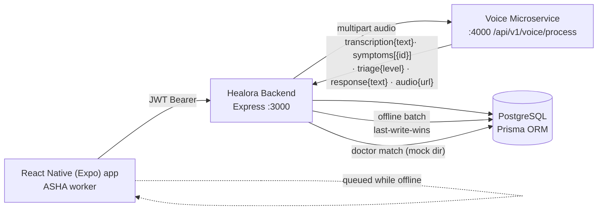

# Architecture — Healora Backend

> Last updated: 2026-09-06

## Overview
Healora is an offline-first, rural healthcare platform for **ASHA workers** (Indian community
health workers). The backend is a REST API that manages patients, voice-driven triage, doctor
appointment matching, referrals, follow-ups, and offline data synchronization. It integrates with
a separate **voice microservice** (teammate-built) that performs transcription, symptom extraction,
and triage classification — the backend only forwards audio and stores the returned verdict.

## System Architecture



## Module Breakdown

### `src/config`
- **env.js** — loads `.env`, exposes typed config (`port`, `jwtSecret`, `voiceServiceUrl`). Single source for env vars.
- **db.js** — one shared `PrismaClient` instance (prevents connection exhaustion).

### `src/middleware`
- **auth.js** — `authenticate` verifies Bearer JWTs and sets `req.user = { id, role }`; `authorize(...roles)` is a factory for role checks.
- **errorHandler.js** — final middleware; converts any error into a JSON response. Never lets an error crash the process.

### `src/routes`
Thin wiring layer: path → middleware → handler. Naming convention `XxxRoutes.js`.
All routes except `/api/auth/*` are JWT-guarded.

### `src/controllers`
One file per resource: `auth`, `patient`, `triage`, `appointment`, `referral`, `followUp`, `sync`.
Every handler is `async (req, res, next)` with try/catch + `next(error)`; uses only Prisma Client.

### `src/services`
- **voicePipelineClient.js** — axios wrapper; posts multipart audio to the voice microservice and normalizes the response.
- **doctorMatchService.js** — keyword-scores symptom tags → specialist; queries the MOCK `Doctor` directory filtered by availability + facility tier; generates candidate appointment slots.
- **syncService.js** — last-write-wins upsert (`updatedAt` comparison) + payload normalization for offline records.

### `prisma/schema.prisma`
7 models (`Patient`, `AshaWorker`, `Doctor`, `TriageRecord`, `Appointment`, `Referral`, `FollowUp`),
4 enums. All PKs are client-generatable UUIDs (offline-first). `TriageRecord.symptoms` is `String[]` (Postgres `text[]`).

### `seed/seed.js`
Seeds 9 mock doctors across 4 specialties/facility types, 4 sample patients, a demo ASHA worker,
plus demo triage/referral/follow-up records.

## Mobile App — `healora-app/` (Expo RN, ASHA-worker client)
Built Phases A–C (2026-09-06). **Expo SDK 57** + React Native 0.86 + TypeScript, React Navigation v7 native-stack, `expo-audio` (record/playback), `expo-secure-store` (JWT), `expo-status-bar`, `expo-asset`. Runs in **Expo Go** — no native build. App `.nvmrc` = **22.23.2** (backends stay 20.11.1).
- **Layers:** `src/api` (axios `client` + auth + patients + triage + config), `src/store` (authStorage/context), `src/hooks` (`useVoiceRecorder`), `src/navigation` (RootNavigator + auth guard), `src/screens` (Login, Home, PatientPicker w/ inline create, RecordTriage, TriageResult, Appointments [Phase-D stub]), `src/theme` + `src/i18n` (EN/हिंदी labels, default EN), `src/utils` (`audioUrl.ts` host rewrite).
- **Voice triage flow:** hold-to-record (m4a, HIGH_QUALITY) → `POST /api/triage` (multipart `audio` + `patientId`) → TriageResult renders `riskLevel` badge, symptom chips, server `autoReferral` card, and server TTS audio (host rewritten to LAN host, keeps :4000).
- **Error handling in-app:** 422 → "didn't catch that"; 502 → "voice service unreachable"; 401 → auto-logout; network (status 0) → generic login/save failure (see AGENTS.md gotcha).

## Data Flow

### Online triage flow
1. RN app uploads `{ audio, patientId }` → `POST /api/triage` (auth middleware, multer in-memory).
2. Controller forwards buffer via `voicePipelineClient` to the microservice.
3. Client normalizes the microservice shape into `{ transcription, symptoms[], riskLevel, ttsResponse, audioUrl }`; unclear results (`STT_FAILED`, `requiresConfirmation`, `UNKNOWN`) surface as 422 instead of being stored.
4. Controller persists `TriageRecord` (linked to patient + `req.user.id`).
5. If `riskLevel` is `EMERGENCY`/`URGENT` → auto-creates a `Referral` to a higher facility.
6. Response to app includes the record + `ttsResponse` + `audioUrl` + optional `autoReferral`.

### Offline sync flow
1. App queues records on-device when offline.
2. App calls `POST /api/sync` with `{ triageRecords, appointments }` when connectivity returns.
3. Each record upserts via `syncService` — created if absent, overwritten if newer (`updatedAt`),
   server copy kept if older (conflict reported in summary).
4. Upserted records are marked `synced = true`.

### Appointment flow
`symptoms + riskLevel` → `doctorMatchService.suggestSpecialty` → MOCK doctor filtered by
`available` + facility tier → `Appointment` created `PENDING` with a suggested slot → worker confirms via
`PATCH /:id/confirm`.

## External Integrations
- **Voice microservice** (`VOICE_SERVICE_URL`, default `http://localhost:4000`) — `POST /api/v1/voice/process`, multipart field `audio`. Owned by a teammate; contract shared via `voicePipelineClient.js`. Not started locally → triage returns 5xx (expected). Runs `PRIMARY_STT=vosk` (Devanagari-native) with whisper fallback; must run under **Node 20.11.1** (`.nvmrc` in both repos) because the vosk/`ffi-napi` native build breaks on NAPI v10 in newer LTS minors. Full path-to-green and evidence baseline in `AGENTS.md`.
- **PostgreSQL via Supabase** (`DATABASE_URL`) — hosted Postgres, direct connection on port `5432` (no PgBouncer, no adapter). The only data store. Setup uses the init migration from `prisma/migrations/` applied with `prisma migrate deploy`.

## Key Design Decisions
- **UUID primary keys** — records are created offline on the device; UUIDs need no central counter and cannot collide on sync.
- **Last-write-wins conflict resolution** — simplest correct strategy for one-writer-per-record rural usage; cheap and explainable.
- **Trust the token, not the body** — `ashaWorkerId` always comes from `req.user.id`, never from the request body (prevents workers attributing records to others).
- **Negative checks in services** — backend never reimplements triage; the voice service is the single source of truth for `riskLevel`.
- **Centralized error handling** — every controller calls `next(error)`; the app ends with a 4-arg error middleware. No unhandled rejections.
- **`select`/whitelisting on responses** — `passwordHash` is never serialized back to clients.

## Directory Structure
```
SIH_project_26/
├── healora-app/          ← Expo RN client (ASHA worker, SDK 57) — see its README.md
├── healora-backend/      ← this repo
│   ├── prisma/schema.prisma
│   ├── seed/seed.js
│   ├── src/
│   │   ├── app.js
│   │   ├── server.js
│   │   ├── config/{env,db}.js
│   │   ├── controllers/{auth,patient,triage,appointment,referral,followUp,sync}Controller.js
│   │   ├── routes/{auth,patient,triage,appointment,referral,followUp,sync}Routes.js
│   │   ├── services/{voicePipelineClient,doctorMatchService,syncService}.js
│   │   └── middleware/{auth,errorHandler}.js
│   ├── AGENTS.md
│   ├── PHASE.md
│   ├── README.md
│   └── .env.example
└── hindi-voice-service/   ← voice microservice (teammate, Node 20.11.1)
```

## Known Limitations
- `Doctor` directory is mock (no real integration); appointment slots are generated, not from a real schedule.
- Doctor-role auth exists in the schema/enum but no doctor login endpoint is built.
- No test suite; verification is dev-server + a smoke suite (see PHASE.md — 15/15 passing).
- Voice service must be running on `:4000` for the triage endpoint — not bundled with this repo.
- Supabase free tier pauses after ~1 week of inactivity — unpause before demo day.
- **Mobile app (Phase 7, BUILT 2026-09-25 — app renamed to **Medola**):** appointments confirm flow, follow-up dashboard, offline queue (expo-sqlite + auto-sync on reconnect + SyncStatusScreen) all implemented; the patient picker falls back to a cached-patient SQLite snapshot when offline so voice triage works end-to-end without a network; on-device mic/UX probe still the only live-untested item.